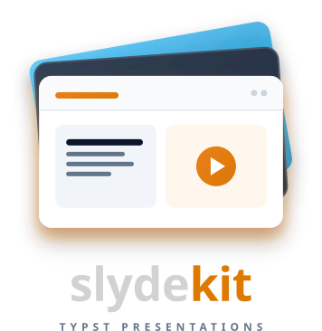

# Slydekit

[](https://github.com/maucejo/slidekit/releases/tag/0.1.0)
[](https://github.com/maucejo/slydekit/blob/main/LICENSE)
[](https://github.com/maucejo/slidekit/blob/main/docs/manual.pdf)

<p align="center">

</p>

<p align=center>
<b><em>Simple yet powerful slides</em></b>
</p>

Slydekit is a Typst presentation template designed to make slide creation simple and flexible. Its theme system, inspired by Bookly, makes it straightforward to design and integrate new themes.

Presentations are built directly from document headings, with five predefined themes included out of the box. Slydekit offers a lightweight but complete set of tools for incremental content reveals, slide navigation, styled boxes, and citation handling. The entire framework relies on Typst’s native state and query system, avoiding the need for an additional templating layer.

## Import and initialization

Slydekit is used as a #show rule at the top of your document. Everything else in the file is written as ordinary Typst content: headings become sections and slides, and no #slide[...] wrapper is required.

```typ
#import "@preview/slydekit:0.1.0": *

#show: slydekit.with(
  title: "Title",
  subtitle: "Subtitle",
  short-title: "Short-title",
  author: "John Doe",
  date: "31 July 2026",
  institution: "Your institution",
  theme: metropolis,
  lang: "fr",
  aspect-ratio: "16-9",
  navigation: "topbar",
)

#title-slide

= Introduction

Some introductory content.

== A first slide

This is a slide, created automatically from the level-2 heading above.
```

Every argument to `slydekit(..)` is optional and falls back to a sensible default:

| Argument | Purpose |
|---|---|
| `title`, `subtitle`, `short-title`, `author`, `date`, `institution`, `contact` | Front-matter shown on the title slide |
| `theme` | `metropolis`, `simple`, `fancy`, `cambfurt`, `chalkboard` |
| `fonts` | Dictionary overriding `body`, `math`, `raw` fonts |
| `colors` | Dictionary overriding any of the theme's colors |
| `lang` | `"fr"`, `"en"` — drives both `set text` and the built-in localization strings |
| `aspect-ratio` | `"16-9"` or `"4-3"` |
| `navigation` | `"topbar"` or `"minislide"` |
| `title-logo`, `slide-logo` | Logo(s) for the title page and the running footer |
| `handout` | Handout mode |

Structuring content is purely heading-driven:

- a level-1 heading (`= Section`) opens a new section and resets the progress indicators;
- a level-2 heading (`== Slide title`) opens a new slide, equivalent to calling `#slide[...]` directly;
- `#slide(steps: n)[...]` can be used explicitly when a slide needs a manual override on its number of reveal steps, or a `label:` for cross-referencing with `@ref`.

## Main features

**Automatic, document-first slide creation.** Slides come from headings, so a talk reads like a normal Typst document. `#slide` is still available for explicit control (custom step counts, labels).

**A full incremental-reveal vocabulary, all built on one primitive.** `#pause`, `#uncover(..)`, and `#only(..)` behave like their Beamer/Touying equivalents. Everything else in the vocabulary is a thin wrapper around that same `uncover`/`only` mechanism rather than a parallel implementation, so it inherits its correctness and its `cover-fn` hook automatically:

- `item-by-item(start: n, body)` does the same for a `list`, `enum`, or `terms` block. It filters the direct children for `list.item`/`enum.item`/`terms.item` and reveals each in place, without ever reconstructing the container, so native list styling (markers, spacing, `#set list(..)`) is untouched
- `alternatives(start: n, repeat-last: bool, ..options)` shows one option per step in the same footprint, with `repeat-last: true` keeping the final option on screen instead of disappearing once its step is past.
- `#meanwhile` splits a slide's top-level flow into parallel tracks at the point it's used, each with its own local `#pause` chain, advancing on the same subslide clock instead of one long concatenated sequence. This reproduces Touying's `#meanwhile` directly: `First #pause Second #meanwhile Third #pause Fourth` shows *First, Third* on the first step and all four on the second
- `track(body)` splits its own content at `#pause` independently of the slide's main flow, so two adjacent columns (typically inside a `#grid(..)`) can each carry their own pause sequence, synchronized on the same subslide clock rather than concatenated into one long chain
- `reveal(..)` exposes the same step logic as a plain boolean instead of content, so CeTZ drawings or Fletcher diagrams can conditionally show elements and still reserve their layout space via a `hide-fn` callback (`cetz.draw.hide(bounds: true)`, for instance)
- `uncover`/`only` also accept a `cover-fn` argument for the same purpose when the content being hidden isn't a boolean-gated diagram but ordinary content that a third-party package wants to mask its own way

**Five built-in themes sharing one architecture.** `metropolis`, `simple`, `fancy`, `cambfurt`, and `chalkboard` (with a color variant) each define the same six-function contract: `theme`, `title`, `toc`, `focus-slide`, `link-box`, `boxeq`, `box`. Because a theme is just a dictionary, any theme merges onto `metropolis` as a base, so a partial custom theme only needs to override the pieces it actually changes.

**Two navigation styles, computed automatically.** `"topbar"` shows the current slide title in a running header; `"minislide"` shows a live, per-section mini-outline (`mini-slides()`) with dots tracking the active slide, built entirely from heading and slide queries, no manual bookkeeping.

**Section-aware progress and outline tools.** `progress-bar`, `section-progress-bar`, `toc`, and `progressive-outline(..)` (a per-slide "you are here" outline with independent numbering for the appendix) all read directly from the document's heading tree.

**A first-class appendix.** `#appendix[...]` restarts slide numbering under an `A.1`-style scheme, and every navigation and outline helper (mini-slides, `show-ref`, `progressive-outline`) is aware of whether a given slide belongs to the main talk or to the appendix.

**Citation and footnote helpers.** `footcite(key)` prints a superscript citation call and silently attaches the full reference as a footnote, for slides where a running bibliography page is impractical.

**A consistent box library.** `info-box`, `tip-box`, `warning-box`, `important-box`, `proof-box`, `question-box`, `code-box`, and the generic `custom-box` share one visual language per theme, colored and iconized consistently.

**Small layout utilities that solve real slide problems.** `adaptive-columns` chooses 1–3 columns depending on measured content height, `full-width` lets a block bleed to the page edge regardless of margin shape, and `row-img` lays out one to many logos with sensible left/center/right alignment.

**Localization out of the box.** Strings such as "Table of contents", "Note", "Tip", or "Proof" are pulled from a JSON dictionary keyed by `lang`, currently covering French and English.

## Comparison with Touying and Polylux

Touying and Polylux are the two most established presentation packages in the Typst ecosystem, and Slydekit deliberately sits close to both in spirit: heading-driven slides, `#pause`/`#uncover`/`#only` semantics, and a theme system. The differences are mostly a matter of scope and defaults.

### Comparison table

| | **Slydekit** | **Touying** | **Polylux** |
|---|---|---|---|
| Slide creation | Heading-driven (`=`, `==`), plus explicit `#slide(..)` for overrides | Heading-driven, plus a richer `#slide[..]` API (waypoints, callback-style animations, cover mode) | Explicit `#slide[..]` calls; headings are not slides by themselves |
| Animation primitives | `#pause`, `#meanwhile`, `#uncover`, `#only` (with a `cover-fn` hook), plus `one-by-one`, `item-by-item`, `alternatives`, `track` for parallel pause chains, and a boolean `reveal()` for CeTZ/Fletcher | `#pause`, `#meanwhile`, `#uncover`, `#only`, `#alternatives`, math-equation animations, native CeTZ/Fletcher integration | `#pause`, `#uncover`, `#only`, plus a lower-level overlay API that most themes build on |
| Built-in themes | 5 (`metropolis`, `simple`, `fancy`, `cambfurt`, `chalkboard`), sharing one merge-onto-`simple` contract | 6 built-in (`simple`, `metropolis`, `dewdrop`, `university`, `aqua`, `stargazer`) plus a large third-party catalogue on Typst Universe | 1 minimal `simple` theme in core; most visual variety comes from independent community packages (e.g. `metropolis-polylux`, `rectangles-polylux`, `helios-polylux`) |
| Navigation / outline | `topbar` or `minislide`, both auto-generated from headings; `progressive-outline` for per-slide mini-TOC | Rich navigation and progress components as part of its component library, theme-dependent | Left to individual themes; core Polylux stays low-level |
| Appendix handling | First-class `#appendix[..]` with independent numbering and appendix-aware navigation | Supported via slide recall / appendix patterns, more manual | Not built in; left to the user or a theme |
| Speaker notes, PPTX/HTML export | Through external packages like presio | Yes — dual-screen speaker notes, PDF/PPTX/HTML export via companion tools | Yes — pdfpc integration for speaker notes and timers |
| Theming model | Fixed functions contract (`theme`, `title`, `toc`, `focus-slide`, `link-box`, `boxeq`, `box`) per theme, merged onto `simple` as a base | A `self` dictionary threaded through the whole rendering pipeline (`utils.merge-dicts` of `config-colors`, `config-info`, `config-page`, `config-common`, ...). Any custom function that wants `self` must be wrapped in `touying-fn-wrapper`/`touying-slide-wrapper`, but in exchange, any new piece of shared config is just a new key in that dictionary, no plumbing required elsewhere | No shared contract in core; themes are separate community packages |
| Scope | Academic-presentation features pre-wired: citations, appendix, boxes, bilingual localization | Broad, general-purpose slide framework, largest feature surface of the three | Minimal core, intentionally low-level, designed to be built upon |

### Summary

Polylux remains a low-level toolkit intended to be extended rather than a complete presentation framework. Touying and Slydekit, by contrast, both aim to provide fully featured, ready-to-use solutions, but they achieve this goal through fundamentally different approaches to extensibility and theming.

Touying relies on its self object to expose an open-ended configuration interface. Any function—including those implemented by theme authors or third-party packages—can declare itself touying-fn-wrapper-aware and access or extend self without requiring changes to the framework itself. Slydekit instead builds on Typst's native context and state mechanisms to expose shared information such as colors, fonts, and the current subslide index. Consequently, it requires neither a self object nor wrapper functions: animation primitives such as uncover and only, together with all higher-level constructs built upon them, behave as ordinary Typst function calls.

The trade-off is more limited than it may initially appear. Slydekit's core state definitions (sk-states) and the slide()/slydekit() functions only need to evolve when a new piece of state must be synchronized with the presentation lifecycle itself—for example, values that are initialized once per presentation or updated once per subslide. In contrast, theme authors and helper functions are free to define their own local state() or counter() values whenever they need persistent information that is independent of the slide lifecycle. These custom states can be accessed directly through Typst's context mechanism without modifying Slydekit's core implementation. The main distinction is therefore not the ability to introduce new state, but the way it is organized: Touying centralizes shared state in a single self object accessed through wrapper functions, whereas Slydekit lets state remain decentralized and directly accessible wherever it is declared.

As a result, it is not simply that Touying is "more flexible." Rather, its flexibility and the additional complexity introduced by the self/wrapper mechanism are two aspects of the same design choice. Slydekit deliberately opts for a simpler architecture by dispensing with both simultaneously.

Despite these architectural differences, the two frameworks offer comparable animation capabilities. Slydekit's #pause, #meanwhile, #uncover, #only, one-by-one, item-by-item, and alternatives commands cover the same core use cases as Touying's animation vocabulary. In particular, #meanwhile provides the same top-level synchronization mechanism, while track extends this behavior to content nested inside grids. Likewise, incremental mathematical expressions, for which Touying provides the `pause` function, can be implemented using the generic `uncover` and `only` primitives. The primary features intentionally left outside Slydekit's scope are Touying's export infrastructure (PPTX and HTML) and its speaker-note system, the latter being obtained from external packages like Presio.

## Themes at a glance

| Theme | Description |
|---|---|
| `metropolis` | Beamer-mtheme inspired: dark header/footer bar, orange accent, progress bar |
| `simple` | Minimal, no background fill, blue accent |
| `fancy` | Warm red-on-slate palette, Lato/Cascadia Code |
| `cambfurt` | Deep red academic look, no background fill |
| `chalkboard` | Light-blue (or red, via `chalkboard-colors-variant`) on a Pennstander-set "handwritten" typeface |

Any theme's colors and fonts can be overridden per presentation via the `colors` and `fonts` arguments to `slydekit(..)`, without needing to fork the theme file.

## Dependencies

* `showybox:2.0.4` : for custom boxes.

## Licence

MIT licensed

Copyright © 2026 Mathieu AUCEJO (maucejo)

